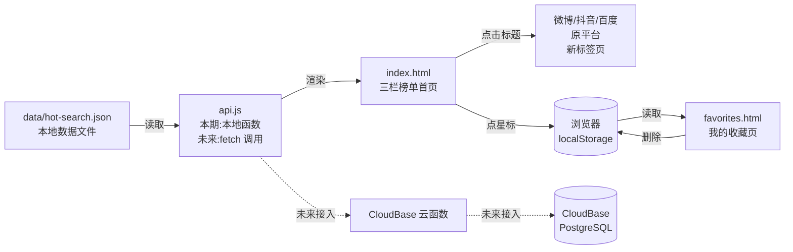

# TECH_DESIGN.md —「今日热搜」技术设计文档

> Day 5 产出 | 2026-09-20 | 作者:xuche(由 AI 协助整理)
> 项目:今日热搜
> 默认路线:方案 C(纯前端 + 接口占位 + 本地 JSON,本期不实现后端)

---

## 一、为什么选方案 C(取舍说明)

比较了 3 套路线,详细对比见对话记录。核心取舍:

- **选 C 不选 A**:A 太"扁平",虽然能跑通,但写完代码你只学到"前端三件套",没学到"前端怎么跟后端说话"。C 多花 10 分钟在文档上定义接口形状,代码里就要为这些接口写"假装是后端的本地函数",等于**提前演练了接后端的姿势**。
- **选 C 不选 B**:B 是清单给的示范路线,完整但重——28 天零基础要做 React+云函数+PostgreSQL+托管四件套,等于在第一周就打完 boss。砍掉的"不建后端"那一刀等于白砍。
- **C 的代价**:文档里要写"本期后端占位"说明(本节),避免后期接手的人(可能是你自己)看不懂"为什么代码里没有真的 `fetch('/api/...')`"。

---

## 二、项目结构

```
vibe-coding-journey/
├── index.html          首页(三栏榜单 + 星标收藏按钮)
├── favorites.html      我的收藏页
├── about.html          关于/说明页
├── data/
│   └── hot-search.json 数据文件(三平台各 10 条热搜)
├── assets/
│   ├── styles.css      样式(响应式 + 三栏布局)
│   └── app.js          首页逻辑(读 JSON + 渲染 + 星标)
├── assets/
│   └── favorites.js    收藏页逻辑(读 localStorage + 渲染列表)
├── .env.example        环境变量模板(本期为空,占位)
├── .gitignore          已包含 .env 挡板
├── AGENTS.md           项目规则
├── research.md         需求研究
├── Myresearch.md       项目二研究(本项目用不到)
├── PRD.md              产品需求
└── TECH_DESIGN.md      本文档
```

---

## 三、数据模型

### 3.1 热搜数据(对应 `data/hot-search.json`)

| 字段名 | 类型 | 必填 | 说明 |
| --- | --- | --- | --- |
| `id` | string | 是 | 唯一标识,如 `"wb-001"`。用于收藏键 |
| `platform` | string | 是 | `"weibo"` / `"douyin"` / `"baidu"` |
| `rank` | number | 是 | 排名 1-10 |
| `title` | string | 是 | 热搜标题 |
| `heat` | number \| null | 否 | 热度值,部分平台可能为空 |
| `link` | string | 是 | 跳转原平台的完整 URL |
| `timestamp` | string | 是 | 数据采集时间,ISO 8601 格式 |

### 3.2 收藏数据(对应 `localStorage`)

| 字段名 | 类型 | 说明 |
| --- | --- | --- |
| `id` | string | 同热搜数据的 `id`,用于去重 |
| `favoritedAt` | string | 收藏时间,ISO 8601 格式 |

存储 key:`localStorage["hot-search-favorites"]`,值为 JSON 数组。

### 3.3 数据示例(JSON 片段)

```json
[
  {
    "id": "wb-001",
    "platform": "weibo",
    "rank": 1,
    "title": "示例微博热搜话题",
    "heat": 1234567,
    "link": "https://s.weibo.com/weibo?q=%23%E7%A4%BA%E4%BE%8B%23",
    "timestamp": "2026-09-20T09:00:00+08:00"
  }
]
```

---

## 四、API 列表(本期为占位,接口形状先定)

### 4.1 接口形状总览

| 方法 | 路径 | 作用 | 本期实现 | 未来对接 |
| --- | --- | --- | --- | --- |
| GET | `/api/hot-search` | 获取所有热搜 | ❌ 占位(读 `data/hot-search.json`) | CloudBase 云函数 + PostgreSQL |
| GET | `/api/hot-search/{platform}` | 获取某平台热搜 | ❌ 占位(JSON 过滤) | 同上 |
| GET | `/api/favorites` | 获取当前用户收藏 | ❌ 占位(读 `localStorage`) | 同上 + 登录态 |
| POST | `/api/favorites` | 新增一条收藏 | ❌ 占位(写 `localStorage`) | 同上 |
| DELETE | `/api/favorites/{id}` | 删除一条收藏 | ❌ 占位(清 `localStorage` 项) | 同上 |

**本期约定**:前端代码不直接 `fetch('/api/...')`,而是封装一层 `assets/api.js`(本期不创建,Day 7 写代码时建),把"调 API"统一成"调本地函数"。这样未来接真后端时,只改 `api.js` 一个文件。

### 4.2 响应格式(统一约定)

```json
{
  "code": 0,        // 0=成功,非 0=失败
  "message": "ok",  // 失败时的错误描述
  "data": { /* 业务数据 */ }
}
```

---

## 五、前后端数据流

### 5.1 文字描述

**首页加载流程**:
1. 浏览器请求 `index.html` → 服务返回 HTML
2. HTML 加载 `assets/styles.css` 和 `assets/app.js`
3. `app.js` 调用"假 API" `getHotSearch()`,实际从 `data/hot-search.json` 读数据
4. 按 `platform` 字段把数据分成三组,分别渲染到三栏
5. 用户点星标 → 调用"假 API" `addFavorite(id)`,实际往 `localStorage` 写一条
6. 用户点击标题 → `<a target="_blank">` 新标签页跳到 `link`

**收藏页加载流程**:
1. 浏览器请求 `favorites.html`
2. `favorites.js` 调用"假 API" `getFavorites()`,从 `localStorage` 读所有收藏
3. 按 `favoritedAt` 倒序渲染
4. 用户点删除 → 调用"假 API" `removeFavorite(id)`

### 5.2 数据流图(Mermaid,GitHub 自动渲染)



---

## 六、错误处理

| 场景 | 用户看到什么 | 代码层处理 |
| --- | --- | --- |
| JSON 加载失败(404/解析错) | 「数据加载失败,请刷新重试」+ 刷新按钮 | `try-catch`,失败时显示降级 UI |
| 某平台数据为空(0 条) | 该栏显示「暂无数据」 | 数据按 `platform` 分组,空数组单独处理 |
| 收藏列表为空 | 「你还没有收藏任何热搜」+ 返回首页 | 数组长度为 0 时显示空状态 |
| 跳转链接失效 | 新标签页 404/打不开 | 当前页面不报错;提示用户检查链接 |
| `localStorage` 被禁用(隐私模式) | 星标点击无效,弹窗提示「请允许浏览器存储」 | 写入前 `try-catch` |

---

## 七、环境变量

本期**不引入任何真实环境变量**;`.env.example` 是空文件,占位用。

| 变量名 | 用途 | 本期值 |
| --- | --- | --- |
| `HOT_SEARCH_API_URL` | 未来后端 API 地址 | 空 |
| `CLOUDBASE_ENV_ID` | CloudBase 环境 ID | 空 |
| `DB_CONNECTION_STRING` | 数据库连接串 | 空 |

**`.gitignore` 已包含 `.env`**,以后真接后端时,本地 `.env` 不会被提交。

---

## 八、部署和迁移注意事项

### 8.1 本期部署方式

**不部署**。本地双击 `index.html` 就能看,或用 VS Code Live Server 启动一个本地静态服务。

### 8.2 未来部署路线(写到 CloudBase 静态托管时)

1. 把整个 `vibe-coding-journey/` 推到 CloudBase 静态托管
2. `data/hot-search.json` 必须随前端一起部署,**不能放数据库**(本期没数据库)
3. `.env` 不能上传,只上传 `.env.example`

### 8.3 从「前端 + 本地 JSON」迁移到「前端 + CloudBase 后端」

**改动清单**(只列会动的部分):

| 步骤 | 文件 | 改什么 |
| --- | --- | --- |
| 1 | `assets/api.js` | 把本地读 JSON 换成 `fetch` 调用云函数 |
| 2 | CloudBase 控制台 | 新建 Node.js 云函数 `getHotSearch`,读 PostgreSQL 返回 |
| 3 | CloudBase 控制台 | 新建数据库表,迁移 `data/hot-search.json` 数据 |
| 4 | 数据更新方式 | 从"手动改 JSON"升级为"定时任务触发云函数抓取" |
| 5 | `.env` | 填上真实 API 地址 |

**前端业务代码(渲染、星标、跳转)零改动**——这就是"接口形状先定好"的红利。

### 8.4 数据迁移风险

- **热搜数据时效**:迁移当天的 JSON 是当天数据,迁移后第一次抓取会替换,**当天用户体验无影响**
- **localStorage 收藏**:浏览器本地存储**不会**随迁移自动同步到云端。**给用户的提示**:迁移当天会要求用户重新登录/迁移收藏(本期不做,只是预留提醒位)

---

## 九、尚未决定的地方

- **样式方案**:用原生 CSS 还是引入 Tailwind/Bootstrap?(暂定原生 CSS,够用就保持简洁)
- **图标方案**:星标用 Unicode `★`/`☆`,还是用 SVG/图标库?(暂定 Unicode,零依赖)
- **数据更新方式**:第一版确认手动编辑 JSON;何时升级为自动抓取?(本期不升级)

---

## 十、一句话数据流(回答今日思考题)

> **数据从本地 JSON 文件来,前端 JS 读出来渲染到三栏榜单上;用户点标题,新标签页跳回微博/抖音/百度;用户点星标,把数据 id 写进浏览器的本地存储。**